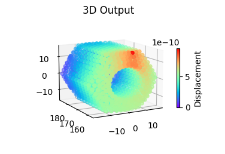

# ME6570_Final
Final Project for John Cotton's ME6570

## Team Roles

- Cameron Roback: CEO
- Daniel Bridavsky: CTO
- Jack Kirschler: Mathematician
- Colton Wright: Generalist

## Setup

All you need to do to run this code is execute the following command inside of a python virtual environment:

    pip install -r requirements.txt

The python libraries used in this project are given below:

- NumPy: https://numpy.org/
- Matplotlib: https://matplotlib.org/
- SciPy: https://www.scipy.org/
- pandas: https://pandas.pydata.org/
- Gmsh: https://gmsh.info/doc/texinfo/gmsh.html
    - Python API: https://gitlab.onelab.info/gmsh/gmsh/blob/gmsh_4_11_1/api/gmsh.py
- meshio: https://github.com/nschloe/meshio
- imageio https://pypi.org/project/imageio/

### Optional: gmsh GUI, not required

Optional: Install gmsh GUI from this [website](https://gmsh.info/#Download)

1. Open .stp file
2. Geometry > Add > Volume
3. Select entire volume
4. Mesh > Define > 3D
5. Export as Abaqus INP (*.inp) so it can work with our python scripts

## User Manual

Once your virtual environment is set up, run `main.py` and pass a .stl file into the program by including it as an argument after the name of the script. An example is shown below:

    (.venv) PS C:\Users\Colton W\Documents\GitHub\ME6570_Final> & "c:/Users/Colton W/Documents/GitHub/ME6570_Final/.venv/Scripts/python.exe" "c:/Users/Colton W/Documents/GitHub/ME6570_Final/src/main.py" "C:\Users\Colton W\Documents\GitHub\ME6570_Final\data\t20_data.step"

This follows a general format we use to pass arguments to scripts all the time:

    python script.py data.cvs

After this, `main.py` will call functions in `input.py` to generate a mesh of tets and return the variables into `main.py`.  Essential and Natural Boundary Conditions can be added by following the examples inside `engine.py`. Any node can be fixed in the x, y, or z directions and any node can also be loaded in the x, y, or z directions. Output plots are created by `output.py`, and are shown below:

It is recommended to set `show_gui` to `True` when calling the input function `stp_to_mesh` so that the Gmsh GUI appears. This will allow you to view the generated mesh, and view nodes that you would like to apply BC's to. The easiest way to apply boundary conditions is to set an entire plane of the part equal to zero. For instance, in `test_mesh_refinement.py` all nodes on the x y plane are fixed. This is done by indexing through all nodes, checking if they are on the plane, and appending that node to a list of EBC's if on the plane. NBC's can be set by finding the x, y, and z coordinates of the desired loading point, indexing through all the nodes, and appending to a list of NBC's if the node is very near that coordinate. A distributed load would be more complex to implement. Index through all nodes and check if they are on the plane that you wish to add a distributed load to. Count how many nodes are in this plane, and distribute the total load across all the nodes inside the plane. Then append that force to the NBC list for each node in the plane. If you wish to apply a distributed load onto a curved surface, a similar process could work, but this would become more complex.

## Abaqus

To run Abaqus using the same part files as in the python code they were imported as STEP files. Gmsh has the ability to creat .inp files which can be directly imported into Abaqus but the software throws an error when attempting to assign material properties to the entire section as seen below:

Because of this error the meshing operation had to be done using the Abaqus mesher instead of gmsh. For simplification of applying the boundary conditions and loads into both the Python code and Abaqus, we decided to use a hexagonal rod. One face of the rod was constrained using the boundary conditions that it could not displace or rotate. The other end was left free and a load which matched the 50,000 N in the code was applied as shown below:

The mesh in this problem was initially made coarse with 45 tet elements and refined 10 times until reaching the free learning edition of Abaqus limit of 1,000 nodes. From this the max displacement in the y direction and Von Mises stress was analyzed for comparison to our engine. The results for this can be cound in the results comparison section. An example of the displacement with 2333 linear tet elements can be seen below showing that the max value is at the node location where the load was applied:

To verify that this value is close to where it should converge the mesh test was also ran using quadratic tet elements with the element number reduced to not go over the 1,000 node limit. The results of this run showed that the max displacement is slightly higer with a displacement of -0.01739 mm. An image of these results can be seen below:

`engine.py` was also ran to determine if the engine aligns with the results from Abaqus. Several different mesh size factors were passed into Gmsh to create fine and course meshes. The script `test_mesh_refinement.py` was used to generate the plots below:

MSF = 0.255

MSF = 0.8

MSF = 3.0

An animation of the mesher was also created to visualize how Gmsh generates meshes. The animation was created by the script `test_mesh_refinement_animation.py` and is available in the `results` folder.

## Results Comparison

When comparing results only 5 refinements were looked at since these were the closest the two meshes came to having the same number of elements. A comparison of the code results to the Abaqus results can be seen in the table below for validation of the program: 

| Run # | Abaqus # of elms (mm)  | Abaqus max displacement | Python # of elms | Python max displacement (mm) | % error |
| ------------- | ------------- | ------------- | ------------- | ------------- | ------------- |
| 1 | 45  | -0.00479  | 48 | -0.000076 | 98.4 |
| 2 | 143  | -0.008835  | 160 | -0.000133 | 98.4 |
| 3 | 518  | -0.01269 | 500 | -0.000269 | 97.8 |
| 4 | 1037  | -0.0143  | 1474 | -0.000457 | 96.8 |
| 5 | 2333  | -0.01563  | 2232 | -0.000510 | 96.7 |

It can be seen that the program has roughly 100% error for each of the runs regardless of the number of elements used but that it does not converge with the examples. Since Abaqus limits the number of nodes allowed in their free version we are not able to compare any higher than around 2000 elements with this system but our program can be tested with much higher numbers of elements to see how it converges. The comparison of this run with the max run allowed by Abuqus can be seen below:

| Abaqus # of elms (mm)  | Abaqus max displacement | Python # of elms | Python max displacement (mm) | % error |
| ------------- | ------------- | ------------- | ------------- | ------------- |
| 2333  | -0.01563  | 22608 | -0.00123 | 92.1 |

The results of this show that as our elements get smaller there is still an error of around 90%, but it is decreasing. To check and see if this modeling error came from meshing differences we decided to create a simple .inp file which modeled a single tet with material properties, boundary conditions, and loads already applied so it could be successfully imported into Abaqus. Running the comparison between this file and our single tet model in Python it showed that the percent error was still roughly around --% with the max displacement in our model being -- mm and the max in Abaqus being --. Images of the Abaqus model and our python model can be seen below. 

